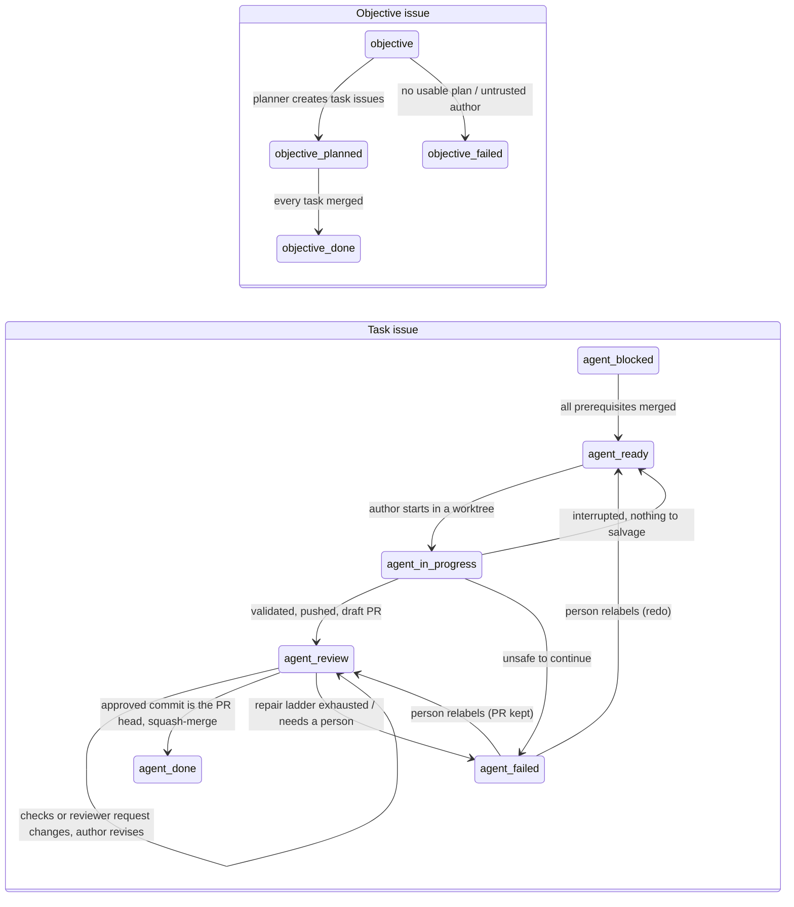

# agent-orchestrator

**An unattended, multi-provider delivery pipeline for a GitHub repository: objectives in, reviewed
and merged pull requests out.**

## In plain words

Software moves slowly when every small change needs a person to write it, check it and file it
away. With this tool, someone describes what they want in an ordinary sentence, and AI
assistants from three different companies do the rest: one plans the work, one builds each
piece, and a different one checks it before anything is accepted. It runs on its own around
the clock, writes down every decision where anyone can read it, and asks a person only when a
real decision is needed. It is for small teams and solo builders who want steady, reviewed
progress on a codebase without supervising every step.

## Overview

You file an `objective` issue in plain language. A PowerShell supervisor, running on a Windows
host, has a planner agent split it into small task issues with an explicit contract (owned paths,
acceptance commands, dependencies); gives each task to an author agent in its own git worktree;
runs the project's tests and the task's acceptance commands on the host; asks a **different**
provider to review the change read-only; and squash-merges exactly the commit that reviewer
approved. Stalls go through a bounded repair ladder before a person is asked, and every decision
is a comment on the issue. It drives **three AI providers (Claude Code, Codex, GitHub Copilot CLI)
across five roles** (planner, implementer, reviewer, repair step, expert recovery).

It was built while delivering a real project; see
[the case study](docs/case-study.md) (124 pipeline-merged pull requests in 13 days).

## Contents

[How it works](#how-it-works) · [Key features](#key-features) · [Quick start](#quick-start) ·
[Configuration](#configuration) · [Security model](#security-model) · [Tests](#tests) ·
[Under the hood](#under-the-hood) · [Why it's useful](#why-its-useful) ·
[Notes from production](#notes-from-production) · [How it compares](#how-it-compares) ·
[Limitations and roadmap](#limitations-and-roadmap) · [Documentation](#documentation) ·
[Repository layout](#repository-layout)

## How it works

Labels on GitHub issues are the state machine; the supervisor moves them.



One unit of work per poll cycle, in priority order: recover stranded `agent-in-progress` issues,
then reviews, then planning, then implementation. One agent runs at a time.

## Key features

| Feature | Where it lives |
| --- | --- |
| Label-driven queue that survives restarts (all durable state on GitHub, per-issue counters in `.agent-state/`) | main loop and `Invoke-Planning` / `Invoke-Implementation` / `Invoke-Review` in `scripts/agent-supervisor.ps1` |
| Author never reviews its own work; merge only of the exact reviewed commit, re-review after a rebase | `Get-EffectiveReviewer`, `Invoke-Review` (`headRefOid` check) |
| Host-side acceptance commands with timeout, denylist and a trusted-authors allowlist | `Invoke-AcceptanceCommands`, `Get-AcceptanceAuthority`, `scripts/lib/trusted-authors.ps1` |
| Configurable test gate plus mechanical checks before any paid review | `Get-MechanicalFailures`, `Get-TestGateFailures`, `Get-BudgetFailures` |
| Bounded repair ladder (hint, task patch, rescope, capability rule, rewrite, author switch) and one expert session | `Invoke-Repair`, `scripts/lib/expert-recovery.ps1`, `scripts/lib/revision-flow.ps1` |
| Crash recovery: exclusive lock, launch-intent records, salvage of interrupted work, reconciliation | `Invoke-Agent`, `Get-LiveWorkerForIssue`, `Invoke-Recovery`, `Invoke-Reconciliation` |
| Quota parsing with exact reset times, per-login cooldowns, reserve Codex logins, provider hand-over | `Get-QuotaBlock` (`scripts/run-agent.ps1`), `Register-QuotaBlock`, `Get-ProviderAccounts`, `Get-EffectiveAuthor` |
| Lessons loop: repeated review findings become rules injected into every prompt, some checked mechanically | `scripts/lessons.ps1`, `docs/agent-prompts/lessons.md` |
| Deterministic ownership widening (tests, companions, budgets) and free rescopes from `## Blocked` reports | `scripts/lib/owned-paths-auto.ps1`, `scripts/lib/task-preflight.ps1` |
| Self-update at cycle boundaries; leaked-process sweep so the restart always comes back | `Update-Self`, `Stop-LeakedLogHolders` (Windows Restart Manager) |
| Owner dashboard: queue, provider quotas, sessions, tokens, live step | `Write-Dashboard`, `docs/dashboard/index.html`, `scripts/serve-dashboard.ps1` |

## Quick start

**Prerequisites** (on the host that will run the supervisor):

- Windows with **Windows PowerShell 5.1** (the scripts target 5.1; PowerShell 7 is not part of the
  test matrix), `git`, and the GitHub CLI `gh` authenticated with `gh auth login`.
- The agent CLIs you want to use, logged in: Claude Code (`claude`), Codex (`codex`), and
  optionally GitHub Copilot CLI (`copilot`). Two providers are the minimum for independent review.
- Node.js only if you want to run the dashboard's JavaScript test.

**1. Prepare the target repository.** Clone it on the host. Add `.agent-state/` to its
`.gitignore`, and give it an `AGENTS.md` (start from
[docs/examples/target-project-AGENTS.md](docs/examples/target-project-AGENTS.md)): every agent
reads it first.

**2. Configure.** Copy [agent-orchestrator.example.json](agent-orchestrator.example.json) to
`agent-orchestrator.json` in the target clone and set at least `repository`, `testGate.command`
and `acceptance.trustedAuthors`.

**3. Dry run** from the target clone (`<tool>` is where you cloned this repository):

```powershell
powershell -NoProfile -ExecutionPolicy Bypass -File <tool>\scripts\agent-supervisor.ps1 -ConfigPath .\agent-orchestrator.json -DryRun -Once
```

A dry run lists the queue and tool availability, writes the dashboard files, and changes nothing
on GitHub (no labels are created, no lock is taken).

**4. One real cycle**, then the loop:

```powershell
powershell -NoProfile -ExecutionPolicy Bypass -File <tool>\scripts\agent-supervisor.ps1 -ConfigPath .\agent-orchestrator.json -Once
powershell -NoProfile -ExecutionPolicy Bypass -File <tool>\scripts\agent-supervisor.ps1 -ConfigPath .\agent-orchestrator.json
```

The first real run creates the ten labels. File an issue labelled `objective` and watch it.

**5. Always on:** register the scheduled task (starts at logon, restarts on exit) and, if you
like, the dashboard on `http://localhost:8765/`:

```powershell
powershell -NoProfile -ExecutionPolicy Bypass -File <tool>\scripts\install-supervisor-task.ps1 -ConfigPath .\agent-orchestrator.json -Start
powershell -NoProfile -ExecutionPolicy Bypass -File <tool>\scripts\serve-dashboard.ps1
```

The task is named `AgentSupervisor` (`-TaskName` for a second repository). How owners file work
is in [docs/HOW_TO_GIVE_OBJECTIVES.md](docs/HOW_TO_GIVE_OBJECTIVES.md); the full behaviour
reference is [docs/AGENT_SUPERVISOR.md](docs/AGENT_SUPERVISOR.md).

## Configuration

Settings come from a JSON file (`-ConfigPath`, or `agent-orchestrator.json` in the current
directory); any parameter passed on the command line wins. There is no default repository.

| Key | Parameter | Default | Meaning |
| --- | --- | --- | --- |
| `repository` | `-Repository` | *(required)* | `owner/name` of the repository whose issues drive the pipeline |
| `stateDirectory` | `-StateDirectory` | `.agent-state` | Local state, logs, prompts and outputs (relative to the clone) |
| `promptsDirectory` | `-PromptsDirectory` | target's `docs/agent-prompts` if it has `implementer.md`, else the tool's | Prompt templates |
| `worktreeRoot` | `-WorktreeRoot` | `../<clone>-agent-worktrees` | Where task worktrees are created |
| `pollSeconds` | `-PollSeconds` | `120` | Idle wait between cycles |
| `plannerProvider` | `-PlannerProvider` | `claude` | Provider for planning and the repair step |
| `testGate.command` | `-TestCommand` | *(none: gate off)* | The project's test command, run on the host before every review |
| `testGate.timeoutSeconds` | `-TestGateTimeoutSeconds` | `600` | The process tree is killed after this |
| `testGate.whenChanged` | `-TestGateWhenChanged` | *(always)* | Regex over changed paths; the gate runs only when one matches |
| `prePushCommand` | `-PrePushCommand` | *(none)* | Generator step run before each push; its output is committed |
| `acceptance.trustedAuthors` | `-TrustedAuthors` | *(none: everyone)* | GitHub logins whose issues may define host-executed commands |
| `acceptance.timeoutSeconds` | `-AcceptanceTimeoutSeconds` | `300` | Per acceptance command |
| `models.claudeExpert` / `models.codexExpert` | `-ClaudeExpertModel` / `-CodexExpertModel` | `claude-fable-5-1` / `gpt-6-astra` | Expert-recovery models; empty = the CLI's default |
| `models.copilot` | `-CopilotModel` | `auto` | Copilot CLI model |
| `limits.maxRevisions` / `maxRepairs` / `maxTotalRevisions` | same names | `6` / `2` / `12` | Revision rounds per attempt, repair decisions, total corrections |
| `limits.swapAfterMinutes` | `-SwapAfterMinutes` | `30` | Hand a task to another provider when its author rests this long |
| `timeouts.plannerMinutes` / `implementMinutes` / `reviewMinutes` | `-PlannerTimeoutMinutes` ... | `25` / `90` / `30` | Per agent session |
| `expertRecovery.enabled` / `timeoutMinutes` | `-ExpertRecoveryEnabled` / `-ExpertTimeoutMinutes` | `true` / `45` | The one privileged correction session per task |
| `agents.shellCommands` | | `python`, `py`, `powershell` | Commands agents may run besides git (translated per CLI) |
| `agents.extraDirectories` | | *(none)* | Read-only material outside the repository granted to agents |
| `agents.sandboxWritableDirectories` | | *(none)* | Folders a project tool writes to, granted to Codex edit sessions |
| `ownership.*` | | see below | Protected paths, test discovery, companions, generated files, budgets |
| `worktree.excludePaths` | | *(none)* | Paths left out of every worktree (sparse checkout) |
| `orphanSweep.processNames` / `commandLineContains` | | *(none)* | Tool processes that may be killed when their launcher chain is gone |
| `lessonsFile` | | `docs/agent-prompts/lessons.md` | Lessons file in the target repository |
| `codexAccountsDir` | `-CodexAccountsDir` | `%USERPROFILE%\.codex-accounts` | Reserve Codex logins, one `CODEX_HOME` per subfolder |

`ownership` keys: `protectedPaths` (never touched, never granted), `testDirectory` + `testFilter`
+ `pathAliases` (a test that mentions an owned path is owned with it), `companions` (`{when, add}`
regex rules), `generatedFiles` (regexes restored when unowned), `budgetsFile` +
`decisionsDirectory` (line caps that need a decision record to raise). Details:
[docs/AGENT_SUPERVISOR.md](docs/AGENT_SUPERVISOR.md#automatic-ownership-widening).

## Security model

Read this before pointing the supervisor at a repository.

- **Acceptance commands run on the host.** The fenced block under `## Acceptance commands` in an
  issue body is executed by the supervisor in a full `powershell.exe`, with the supervisor's
  account and network access, in the task worktree. The denylist (recursive deletes, pushes,
  downloads, registry edits...) is a guard against accidents, **not a sandbox**. Whoever can
  write an issue body that reaches the queue can run code on the host.
- **The test gate and `prePushCommand` also run on the host**, and they execute code that agents
  wrote on the branch. An agent steered by a malicious objective can write a malicious test.
- **Expert recovery uses the CLIs' permission-bypass flags** (`--dangerously-skip-permissions`,
  `--dangerously-bypass-approvals-and-sandbox`): one session per stuck task with host-wide
  execution rights. The prompt limits its scope; nothing technical does. Turn it off with
  `expertRecovery.enabled: false` if the host is not isolated.
- **Issue text is prompt input.** Objectives, task bodies and review comments are read by models;
  treat them as untrusted instructions from whoever wrote them.
- **Mitigation built in:** `acceptance.trustedAuthors`. With it set, acceptance commands run only
  when the task's author and last body editor are on the list (and, for planner-created tasks,
  the objective's author and last editor); otherwise they are reported `NOT RUN (untrusted
  author)` and the reviewer judges those checks by reading. Objectives from anyone else are not
  planned. GitHub records only the last editor of a body; only authors and people with triage or
  write access can edit one.

**Run it in an isolated VM or container** under a dedicated OS user, with a dedicated,
low-privilege GitHub token (fine-grained, one repository, only issues/pull requests/contents),
provider accounts with spending limits, no personal credentials on the machine, and **trusted
issue authors only**. The dashboard server binds to loopback and serves four fixed files. The
quota readers use the CLIs' local credential files only to call the providers' usage endpoints or
to read the plan name, and never write or log tokens (see [docs/AGENT_CREDENTIALS.md](docs/AGENT_CREDENTIALS.md)).

## Tests

Every test runs locally, touches no paid model and never writes to GitHub:

```powershell
Get-ChildItem scripts\test-*.ps1, scripts\tests\test-*.ps1 | ForEach-Object {
    powershell -NoProfile -ExecutionPolicy Bypass -File $_.FullName }
powershell -NoProfile -ExecutionPolicy Bypass -File scripts\test-supervisor.ps1 -DryRun   # adds a real dry run
node scripts\test-dashboard-bars.js
```

Measured for this release on Windows PowerShell 5.1.26100: **18 PowerShell test scripts with
582 passing checks and 0 failures** (581 in the plain run, plus the `-DryRun` smoke check), and
**8 of 8** checks in the JavaScript dashboard test. The two tests that start a real dry run
(`test-dashboard-contract.ps1`, `test-supervisor.ps1 -DryRun`) need an authenticated `gh`; they
read issues from `$env:AGENT_TEST_REPOSITORY` (default: a public sample repository) and print
`SKIP` without `gh`. Tests exercise the real functions: most extract them from the supervisor by
parsing it (PowerShell AST), since dot-sourcing it would start the poll loop, and stub only
GitHub, processes and time.

## Under the hood

### Supervisor state machine

**What.** A single-threaded poll loop (`scripts/agent-supervisor.ps1`, bottom) that reads four
label queries per cycle (plus three throttled ones for the dashboard) and performs one unit of work: `Invoke-Recovery`, `Invoke-Review`,
`Invoke-Planning` or `Invoke-Implementation`. Labels are the state; per-issue counters and
pending work live in `.agent-state/issue-<n>.json`, written atomically (`Save-State`: temp file
plus rename). **How.** Each step re-reads the issue before and after every long agent call and
refuses to publish for an issue a person closed in the meantime. `Invoke-Reconciliation` re-runs
unblocking and objective completion every cycle, so a decision deferred by a transient `gh`
failure is retried instead of stuck. **Why.** A terminal-bound agent loses everything on a
reboot; a label machine loses nothing, and every state change is a comment a person can read.

### run-agent provider wrapper

**What.** `scripts/run-agent.ps1` runs one non-interactive session of Claude Code, Codex or
Copilot CLI with a fixed tool policy per mode. **How.** Edit mode gets file tools, read-only
git, `git add/commit` and the configured shell commands; read-only mode gets reads, read-only
git and the test tools; Codex runs in `--sandbox workspace-write` or `read-only`; Copilot gets
`--no-ask-user` and `--disable-builtin-mcps`, so a tool that is not pre-allowed is denied, never
prompted. The prompt goes through stdin; the supervisor launches the wrapper as a child process
with a deadline and kills the whole tree on timeout. **Why.** Three CLIs with three permission
models become one contract, and the reviewer cannot write by construction, not by instruction.

### Cross-provider review and exact-SHA merge

**What.** The reviewer is always a different provider from the author, and the merge is always
of the commit the reviewer read. **How.** `Get-IssueProviders`/`Get-EffectiveReviewer` never
return the author (a reserve login of the same vendor still counts as the same provider). The
reviewed SHA is captured before the reviewer runs; after approval `Invoke-Review` rebases only
on a real conflict, and if the branch moved, a fresh review is required. It then compares the
worktree's `HEAD` with the pull request's `headRefOid` and merges only on equality. A
`pendingPush` flag, persisted *before* a revision starts, forces an owed push to land before any
new review. **Why.** "Approved" must mean "this code was read"; without the SHA check a revision
that had not been pushed yet could merge older, rejected code.

### Host-side acceptance commands and the test gate

**What.** The supervisor itself runs each task's acceptance commands and the project's test
command on the host before a reviewer is paid. **How.** `Get-AcceptanceCommands` extracts the
fenced block; `Invoke-AcceptanceCommands` runs each line through `-EncodedCommand` in a fresh
`powershell.exe` with a timeout, a denylist, output capped at 3,000 characters, and the
trusted-authors check. Nested `powershell -Command "..."` lines are unwrapped
(`Resolve-AcceptanceCommand`) because the outer shell would expand their `$variables`.
`Get-TestGateFailures` runs `testGate.command` the same way. Failures go back to the author with
the real output; `Get-FailureClass` routes host problems (port in use, access denied, timeouts)
to the repair step instead of the author. **Why.** Agent sandboxes often cannot run the tests,
so authors could not prove and reviewers could not verify; one early task spent eleven review
rounds on a fact the host settles in a second.

### Repair ladder and expert recovery

**What.** Before a person is asked, a read-only repair session decides what the *pipeline*
should change. **How.** `Invoke-Repair` feeds the failure, task, objective, handoff, last review
and acceptance transcript to the planner provider, which returns one JSON decision: `hint`,
`patch-task` (exact find/replace pairs), `rescope`, `capability` (recorded as a pinned lesson
with its workaround), `rewrite-task`, `switch-author` or `human`. `-MaxRepairs` bounds it; three
rescopes per task are free. When the ladder is exhausted or a finding survives three reviews,
`Queue-ExpertRecovery` queues one expert correction with the strongest configured model, on the
existing branch, followed by independent review. Stalls are detected by
`Get-FailureSignature` (the failure text with SHAs, times and durations blanked) rather than by
commit, so cosmetic commits cannot buy another round. **Why.** Most stalls are a wrong task, a
missing file in the scope or a host problem, and a relaunch fixes none of them.

### Crash recovery

**What.** A restart never loses work or starts a second writer. **How.** An exclusive
`FileShare.None` lock allows one supervisor per state directory. `Invoke-Agent` writes a
*launch-intent* record (`pid 0`) before the process exists and upgrades it with PID, start time
and deadline right after; readers treat `pid <= 0` as "unknown, fail closed".
`Get-LiveWorkerForIssue` matches PID and start time, enforces the recorded deadline for workers
that outlived their supervisor, and `Confirm-ProcessTerminated` verifies the whole process tree
is gone before a worktree is touched. `Invoke-Recovery` salvages an interrupted worktree through
the normal gate and publishes it instead of redoing it. `Stop-LeakedLogHolders` asks the Windows
Restart Manager which processes hold the wrapper's log files and kills leaked descendants, so a
self-update restart always comes back. **Why.** Unattended runs meet reboots, crashes and hung
tools; each of these paths exists because one of them happened.

### Quota parsing and reserve accounts

**What.** Running out of allowance is never a task failure. **How.** `Get-QuotaBlock` in
`run-agent.ps1` recognises the CLIs' limit messages, parses the reset time *from the matching
line only* (dated and time-only forms, "10 minutes ago means now", monthly resets), and exits
with code 77. `Register-QuotaBlock` records a cooldown per login in `providers.json`, comments
once per reset time, and rolls back the round. `Get-ProviderAccounts` treats every `CODEX_HOME`
under `codexAccountsDir` as a reserve login used in order; `Get-EffectiveAuthor` hands a task to
another provider after `swapAfterMinutes`, and `Sync-QuotaCooldowns` rests Copilot when its quota
API says the month is spent. **Why.** Without this, a subscription wall consumes review rounds and fails
tasks nobody has actually attempted.

### Lessons loop

**What.** A reviewer finding that recurs across different tasks becomes a rule in every future
prompt. **How.** `Add-Finding` appends blocking findings to `findings.jsonl`;
`Test-RuleSimilarity` (word overlap after stop words, threshold 0.65) matches them against other
tasks' findings; `Add-Or-BumpLesson` creates or bumps an entry in the lessons file, which
`Publish-Lessons` commits to the target's `main`. `Build-LessonsSection` injects active lessons
into the planner, implementer and reviewer prompts within a character budget (pinned seeds are
never dropped). A lesson with a `check` regex and `check-on` target is enforced mechanically by
`Get-LessonCheckFailures` before a review is paid. **Why.** The expensive mistakes were repeated
ones; a rule every prompt carries is cheaper than a review round that rediscovers it.

## Why it's useful

- **Unattended delivery with an audit trail.** The queue keeps moving through nights, quota
  resets and reboots, and every decision -- plan, verdict, repair, merge -- is an issue comment.
- **Review you can trust.** Vendor-diverse authors and reviewers, host-verified checks and
  exact-commit merges mean an approval refers to code that was actually read and actually tested.
- **Cost control.** Mechanical checks, the test gate and incremental review rounds stop paid
  sessions from rediscovering what a script can settle; quota walls pause instead of burning
  budgets.
- **Small, reviewable changes.** Owned paths and bounded tasks keep diffs focused, and the
  repair ladder fixes the task instead of relaunching the same author against the same wall.

## Notes from production

- **A test fixture paused a provider for 16 hours.** A task body quoted provider limit messages
  as test fixtures ("resets 5:30pm"). Codex echoes the whole prompt into its log, so the quota
  parser read the fixture as Codex's real reset time and paused it three times for 14 to 16 hours
  while the real limit lasted minutes. Since then `run-agent.ps1` drops every log line that also
  appears in the prompt and parses the reset time only from the line that matched a limit
  pattern.
- **A Windows update changed how PowerShell 5.1 quotes arguments.** The duplicate-task search
  passes `"Objective: #12" in:body` to `gh`. After the September 2026 update of Windows PowerShell
  5.1 (5.1.26100.9444) the old doubled-quote trick split the phrase in two, every search failed,
  and planning was deferred forever. `Find-ExistingTaskIssues` now passes the quotes as `\"`,
  verified on that build.
- **A process nobody remembered blocked a restart for an hour.** Headless tool processes left by
  an agent inherited the scheduled task's log-file handles; the wrapper could not reopen its log,
  so the supervisor never came back after a self-update. The fix asks the Windows Restart Manager
  exactly which processes hold the file (`Get-FileHolders`) instead of guessing by name.

## How it compares

Well-known open projects approach coding agents from different angles:

- **SWE-agent** gives a single language-model agent a purpose-built command interface for
  working in a repository, and is typically used to resolve an issue by producing a patch,
  notably in research and benchmark settings.
- **OpenHands** is a platform for AI software-development agents: agents that edit code, run
  commands and browse in a sandboxed runtime, usable through its interfaces or programmatically.
- **aider** is interactive AI pair programming in the terminal: you chat with a model about your
  local git repository and it edits files and commits the changes.

This project is not an agent itself; it orchestrates existing vendor CLIs as interchangeable
workers around a GitHub process. What it adds is the operational layer for unattended runs:
vendor-diverse author/reviewer separation, host-verified acceptance commands and tests, merges
bound to the exact reviewed commit, a bounded repair ladder, and resilience to crashes and quota
walls. The pieces are complementary: any of those agents could, in principle, sit behind
`run-agent.ps1` as another provider.

## Limitations and roadmap

- **Windows only.** Process control uses `taskkill`, `Win32_Process` and the Restart Manager;
  the always-on mode is a Windows scheduled task. A cross-platform process layer would open
  Linux containers, which are the better isolation boundary.
- **One task at a time.** Parallel workers need one worktree root and lock per worker and a
  conflict-aware scheduler for owned paths.
- **Host execution is trust-based.** The allowlist limits who can define commands; a real
  sandbox (container per acceptance run) would limit what they can do.
- **Few mechanical lessons.** Two of the eight shipped lessons carry a machine check; the rest
  are prompt rules. Turning more recurring findings into checks is the cheapest quality lever left.
- **Heuristic similarity.** Finding matching is word overlap, which misses paraphrases and can
  merge unrelated findings.
- **Size.** `agent-supervisor.ps1` is 4,640 lines. The pure parts already live in
  `scripts/lib/`; splitting the rest the same way would make it easier to extend.

## Documentation

The full index, grouped for newcomers, operators and reviewers, is in
[docs/README.md](docs/README.md). The most useful entry points:

- [docs/HOW_TO_GIVE_OBJECTIVES.md](docs/HOW_TO_GIVE_OBJECTIVES.md): how to ask for work (no code required).
- [docs/AGENT_SUPERVISOR.md](docs/AGENT_SUPERVISOR.md): the complete behaviour reference.
- [docs/decisions/](docs/decisions/README.md): architecture decision records.
- [docs/case-study.md](docs/case-study.md): what the pipeline delivered on a real project.

## Repository layout

```text
scripts/agent-supervisor.ps1          the supervisor (loop, planning, implementation, review, recovery, dashboard export)
scripts/run-agent.ps1                 one provider session with a fixed tool policy and quota detection
scripts/lessons.ps1                   lessons reader/writer/matcher
scripts/lib/                          pure helpers: ownership rules, preflight, trusted authors, revision flow, expert recovery
scripts/install-supervisor-task.ps1   registers the always-on Windows scheduled task
scripts/serve-dashboard.ps1           loopback-only dashboard server
scripts/test-*.ps1, scripts/tests/    PowerShell test suites (scripts/test-fixtures/ holds their sample data)
scripts/test-dashboard-bars.js        JavaScript test for the dashboard page
docs/README.md                        documentation index
docs/agent-prompts/                   planner, implementer, reviewer, repairer and expert prompts; shared rules; shipped lessons
docs/dashboard/index.html             the owner dashboard page
docs/decisions/                       decision records about the orchestrator
docs/examples/                        template AGENTS.md for a target repository
agent-orchestrator.example.json       configuration template
```

## License

MIT © 2026 Sterium AI. See [LICENSE](LICENSE).
